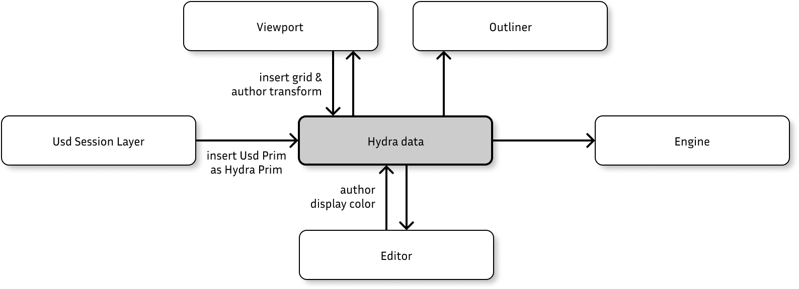
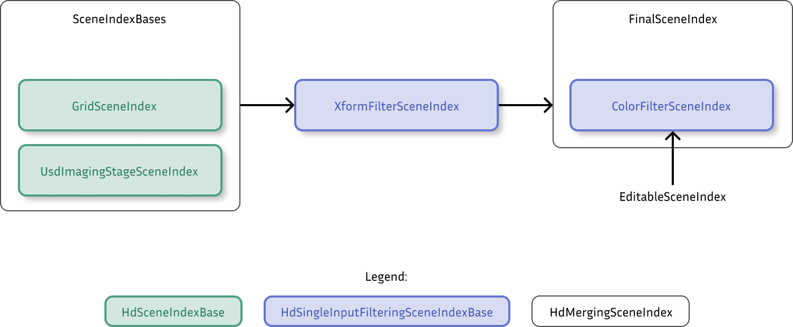

# ImGui Hydra Editor

ImGui Hydra Editor is a Hydra editor written in c++ with the ImGui and OpenUSD frameworks.

This project acts as a playground for USD, and most particularly Hydra 2.0. Therefore, the structure of the application remains simple and contains out of the box examples.

## Building

To build ImGui Hydra Editor, see [BUILDING.md](BUILDING.md) instructions.

## Overview

ImGui Hydra Editor is a tool that process data using the Hydra 2.0 Framework. Every view from the tool has access to read, insert and author the current state
of Hydra data.

### Usd Session Layer

From the Usd Session Layer view, the user can type a stage from scratch, add some predefined USD Prim (camera, cube, sphere, ...) or load a USD file and author it. The Usd Session Layer then converts the USD Prims to Hydra Prims and inserts them to Hydra data.

### Outliner

The Outliner view browses all Hydra prims from Hydra data and displays them in a tree view.

### Viewport

The viewport view authors the transforms (translate, rotate, scale) of Hydra Prims. It also creates and inserts a grid to Hydra data.

### Editor

The Editor view allows the user to author the display color of the selected Hydra Prim. The view also displays all the Hydra attributes from the selection.

### Engine

The Engine consumes Hydra data with all modifications from the views and generates an image from it.

## Scenes Indices

ImGui Hydra Editor implements main concepts of Hydra 2.0 framework out of the box, such as:
* inserting data using [HdSceneIndexBase](https://openusd.org/release/api/class_hd_scene_index_base.html) and UsdImagingStageSceneIndex.
* authoring data via [HdSingleInputFilteringSceneIndexBase](https://openusd.org/release/api/class_hd_single_input_filtering_scene_index_base.html)
* merging multiple data source using [HdMergingSceneIndex](https://openusd.org/release/api/class_hd_merging_scene_index.html)

The views in ImGui Hydra Editor make use of those various types of scene index in order to create the final data to feed to Hydra (Hydra data).

### HdSceneIndexBase

HdSceneIndexBase is used to insert data to Hydra data.

Examples are:
* UsdImagingStageSceneIndex: used by Usd Session Layer to convert USD data to Hydra data.
* GridSceneIndex: used by Viewport to create and insert a grid to Hydra data.

### HdSingleInputFilteringSceneIndexBase

HdSingleInputFilteringSceneIndexBase is used to filter Hydra data in order to author the Hydra Prim states.

Examples are:
* XformFilterSceneIndex: used by Viewport to author the xform of Hydra Prims.
* ColorFilterSceneIndex: used by Editor to author the display color of Hydra Prims.

### HdMergingSceneIndex

HdMergingSceneIndex is used to merge multiple scene indices together.

Examples are:
* SceneIndexBases: merge multiple inputs (USD prim & grid) to a single output.
* FinalSceneIndex: always contains the scene index with the latest changes.

## Rendering

In order for the render engine to be more flexible, the render is performed using HdRenderIndex, HdEngine and HdxTaskController. See the code for more information.

## Viewport navigation

There is two ways to navigate within the viewport: using the guizmo cube or the mouse and keyboard.

### Guizmo cube

Keep pressing on the guizmo cube and move the mouse to rotate around the focus point. Click on faces/edges/vertices from the cube to change the active camera position accordingly.

Note: guizmo cube navigation is not working properly with z up axis (see [Limitation section](#limitations)).

### Mouse and Keyboard

Here are the shortcuts to navigate using the mouse and the keyboard:
* LMB + Alt: Rotate
* LMB + Shift: Pan
* RMB + Alt or Scroll wheel: Zoom
* F: Focus on selection
* W: Local translate
* E: Local rotate
* R: Local scale

## Additional renderers

Every renderer that implements a hydra render delegate can be used in this project to extends the renderer list.

Here is an example of 4 different renderers: Storm, Embree, [Cycle](https://github.com/blender/cycles) and [Arnold](https://github.com/Autodesk/arnold-usd).

Once the custom render delegates are build, don't forget to set the `PXR_PLUGINPATH_NAME` environment variable before launching the application to make use of them.

## And more

Explore the menu bars of the application and viewports, you may find useful fonctionalities such as:
* Create new USD objects in the scenes (Camera, Cube, ...)
* Create new views in the main window
* Switch the active camera to the viewport
* Show/Hide the grid
* Show/Hide ambient light, dome light
* Set global/local transform tool
* ...

## Limitations

There is currently some limitations

* ImGuizmo bug: glitchy navigation by using the gizmo cube when the stage up axis is Z (Z up axis is hardcoded in ImGuizmo)
* ImGuizmo bug: guizmo cube not working if multiple viewports and selection is empty
* Instances editing (e.g. translate) is not currently supported
* Single selection
* No Animation
* Simple events (no signal/slot implementation)
* Instanceable not visible in Outliner
* Instanceable cannot be selected (if so selection will switch to parent)
* No Undo
* Grid is on a separate layer at the back
* Does not keep multiple instances of same view when relaunched